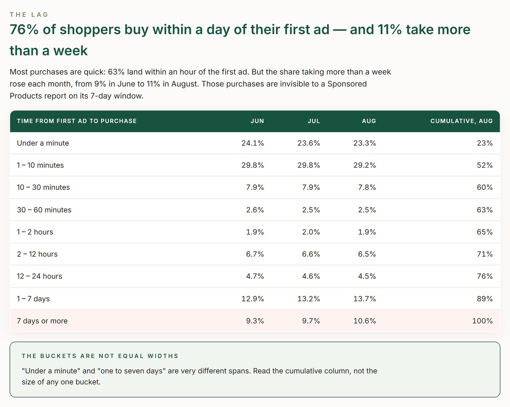

# TrackIQ: Amazon AMC Conversion Lag & Attribution Window

How long does it take a shopper to buy after they first see an ad? Amazon Marketing Cloud counts it in nine time buckets. This skill turns those buckets into two decisions every brand makes by habit: which attribution window its reports should use, and how far ahead of an event the spend should start.

Run it quarterly, and six weeks before any major sales event.

Part of **Amazon AMC & DSP** in the
[TrackIQ skills catalog](https://github.com/TrackIQ-HQ/amazon-seller-skills).

Built as an [Agent Skill](https://code.claude.com/docs/en/skills). Runs in
Claude Code, Claude web, Claude desktop and ChatGPT from the same folder.

---

## Powered by the TrackIQ MCP

[](https://trackiq.com/mcp)

This skill reads your live Amazon account through the
**[TrackIQ MCP](https://trackiq.com/mcp)** — 16 tools connecting your AI
assistant to Amazon data:

Sales & Traffic · Orders · Inventory · Returns · Sponsored Products · Sponsored
Brands · Sponsored Display · Amazon DSP · AMC Cloud · Keywords · Search Terms ·
Targeting · Search Query Performance · Organic Rank · Best Seller Rank · Buy Box
History · Brand Analytics · Export

Works with Claude, ChatGPT and Cursor. **[Get access →](https://trackiq.com/mcp)**

---

## What you get



Reads Amazon Marketing Cloud's time-to-conversion data to show how long shoppers take between their first ad touch and purchase — the share that buys within the hour, the day and the week, and how that shifts month to month — then turns it into two decisions: which attribution window to report on, and how many days ahead of a sales event to start upper-funnel spend. Use when the user asks about time to conversion, conversion lag, attribution window, lookback window, how long customers take to buy, consideration cycle, 7 versus 14 day attribution, or when to start Prime Day or holiday ads.

### The rules that keep it honest

- **Purchases only**
- **The buckets are uneven**
- **"7+ DAYS" is open-ended**
- **This tool cannot rank campaigns by speed**

The full list is in `SKILL.md`, and each one exists because getting it wrong
produces a confident, wrong answer rather than an obvious error.

## Requirements

- The TrackIQ MCP, for `list_marketplaces`, `get_amc_time_to_conversion` and `get_campaigns`. - **AMC enabled on the account.** If the focus month returns no rows, stop and say so. - Nothing else. No filesystem or internet needed. - **Without the MCP:** works from an AMC time-to-conversion export by month.

---

## Install

### Claude Code

```
/plugin marketplace add TrackIQ-HQ/amazon-seller-skills
/plugin install trackiq-amazon-amc-conversion-lag@trackiq
```

### Claude web, desktop, mobile

1. Download the `.zip` from the
   [latest release](https://github.com/TrackIQ-HQ/trackiq-amazon-amc-conversion-lag/releases)
2. **Settings → Capabilities → Skills** (code execution must be on)
3. **Create skill → Upload a skill**, choose the `.zip`
4. Toggle it on

### ChatGPT

Same zip. **Plugins → Skills → Create → Upload from your computer.**

---

## Setup

Answers live in `account.md`, copied from
[`assets/account.example.md`](skills/trackiq-amazon-amc-conversion-lag/assets/account.example.md).
**Every TrackIQ skill reads the same file**, so an account already set up for
another TrackIQ report needs nothing added.

## Delivery

Asked once and stored in `account.md`: **in-chat** (default), **file**,
**Slack**, **n8n** or **email**. Anything leaving the chat confirms with you
first and falls back to in-chat, with a note.

---

## Customizing

| File | What it controls |
|---|---|
| `checks.md` | the pre-send checks |
| `method.md` | the method and every threshold |
| `pulls.md` | the call sequence and its traps |
| `report-template.html` | the report shell |

---

## Contributing

```bash
python scripts/validate.py    # must exit 0 before any commit
python scripts/build.py       # writes dist/ zip + registry.json
```

Read [AUTHORING.md](https://github.com/TrackIQ-HQ/amazon-seller-skills/blob/main/AUTHORING.md)
before proposing changes.

## License

MIT. See [LICENSE](LICENSE).
